# decad

<p align="center">
  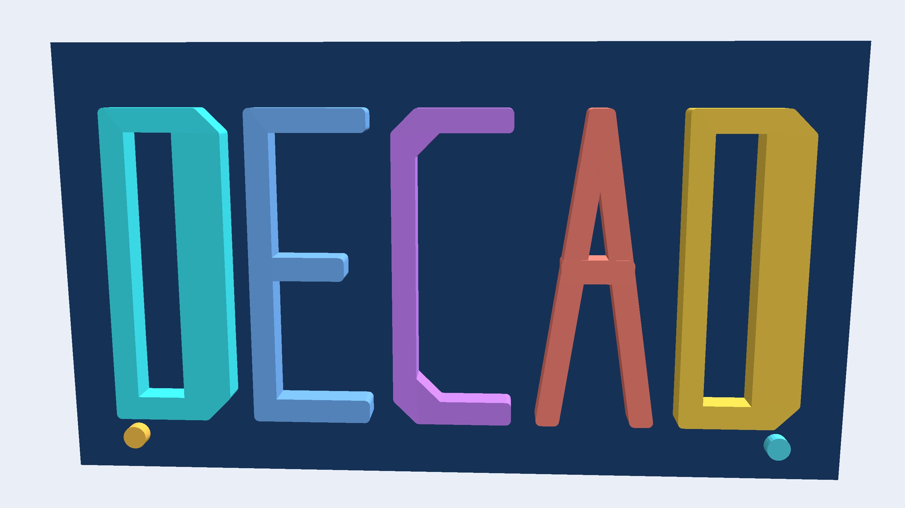
</p>

A **headless CAD engine** for Go: the 3D modeling layer above the
[sketch](https://github.com/lestrrat-3d/sketch) 2D constraint engine and the
[r3](https://github.com/lestrrat-3d/r3) coordinate-math layer.

> **Status: the public API is landing incrementally against an approved
> design.** The API contract is
> [`docs/api-design.md`](docs/api-design.md) — the core design. Companion
> designs carry its deep ends; [`docs/layout.md`](docs/layout.md)'s Layout table lists
> every design document. What the
> package exports today is the leading edge of that surface; everything it does
> not yet export remains design-only, and anything that lands must follow the
> contract. Every capability the contract consumes from its dependencies exists
> today; there are no open dependency gaps.

## Why this exists

decad is built to be driven by a **coding agent as a verification step before it
commits to writing real CAD software code** — an Autodesk Fusion add-in, say.

3D modeling is easy to get subtly wrong: a profile that does not sweep the way
you expect, a feature that leaves a body non-watertight or self-intersecting, a
wall thinner than the tool that has to cut it, two components that interfere.
Discovering that inside Fusion — after the script has run — is expensive.

So an agent reproduces the part here first and interrogates it programmatically:

* Is the body watertight? Does it self-intersect?
* What is its volume, its centroid, its bounding box?
* Do these two bodies collide? Is anything thinner than my end mill?

Only once the geometry is proven sound does the agent carry the plan into the
CAD package. Same bet as `sketch`, one dimension up: **be wrong in the cheap
place, not the expensive one.**

## What it builds

Every part below is a decad body, rendered from the triangle mesh decad itself
tessellates.

| | |
|---|---|
| 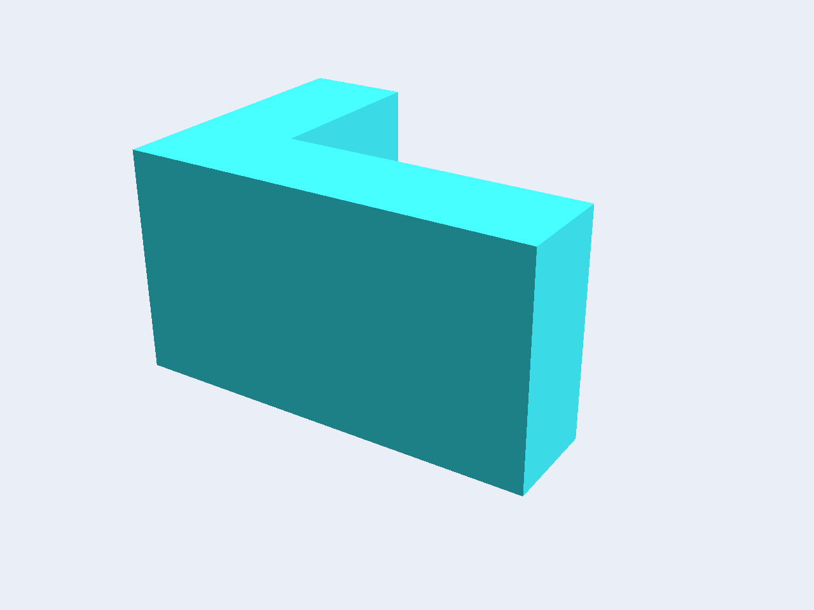<br>**Extrude** sweeps a solved 2D profile straight into a solid. | 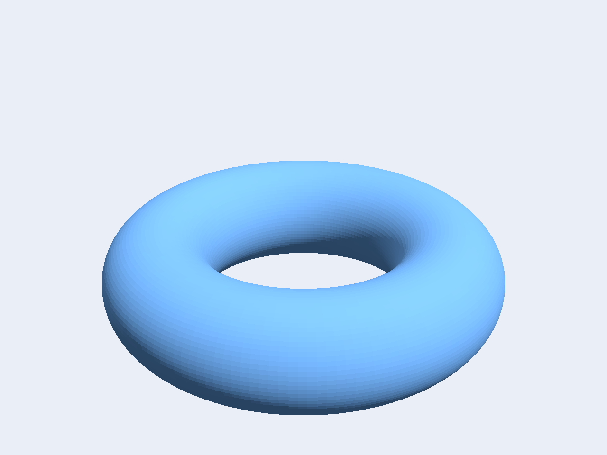<br>**Revolve** spins a profile about an axis, so a curved generator gives a curved solid. |
| 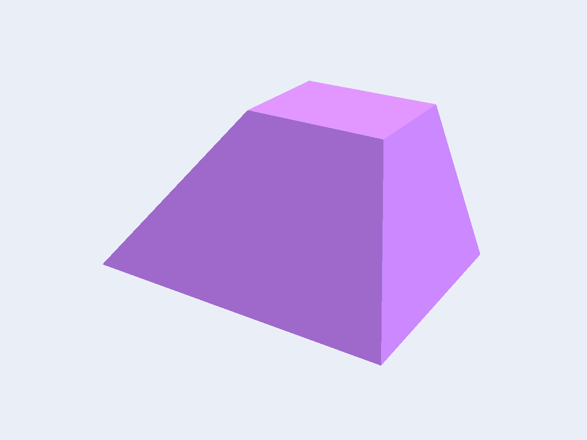<br>**Loft** rules a wall between two profiles on different planes. | 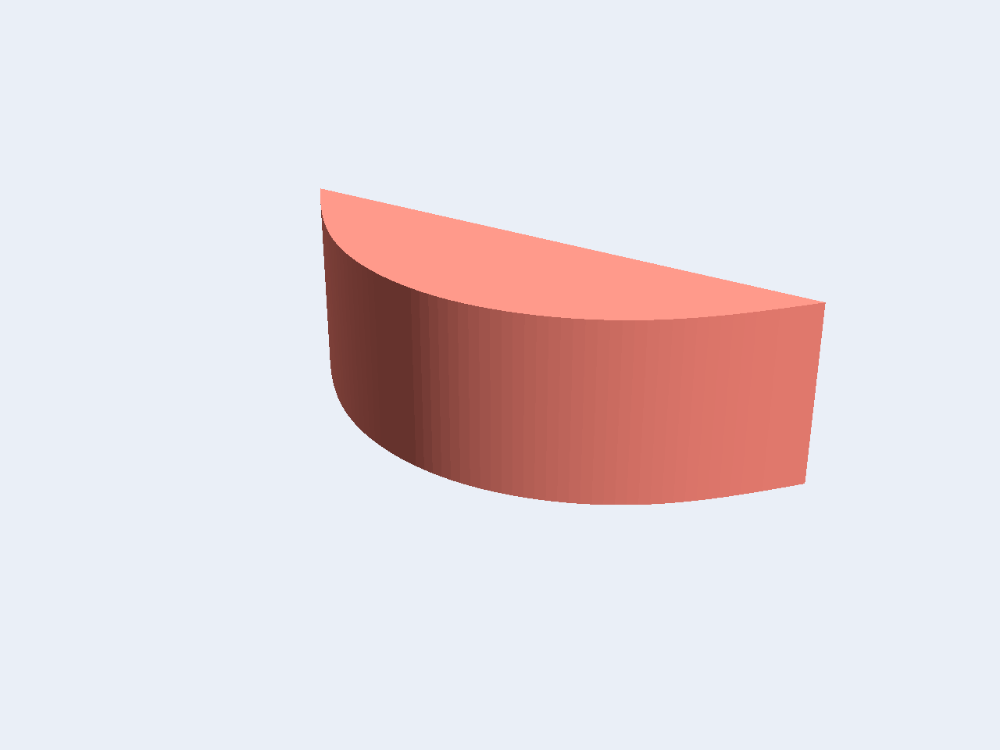<br>**Free-form profiles** carry spline walls, measured exactly rather than approximated. |
| 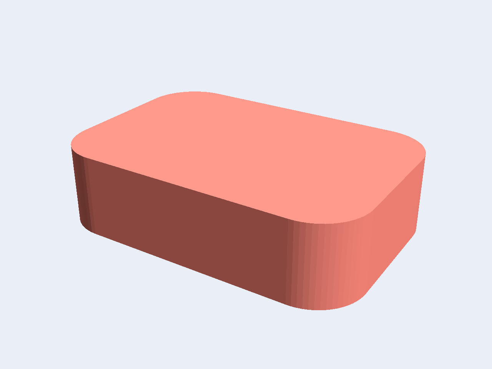<br>**Fillet** rounds selected edges into tangent arcs. | 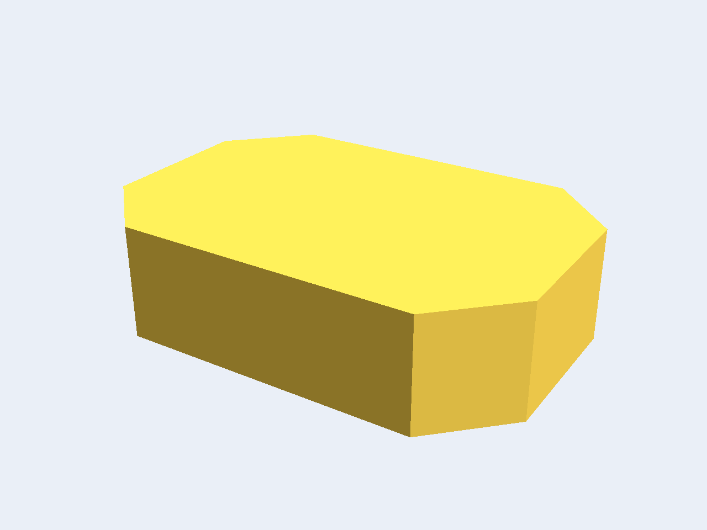<br>**Chamfer** cuts selected edges back to a straight bevel. |
| 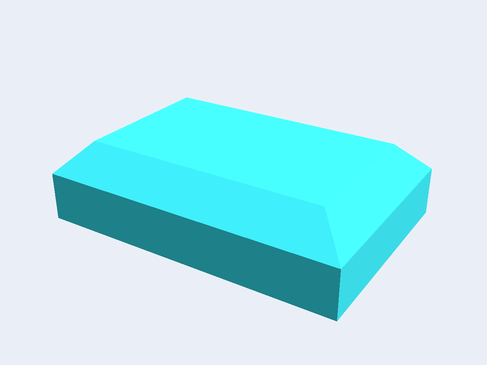<br>**Cap-loop chamfer** bevels a whole rim, the lead-in a bore or a lid needs. | 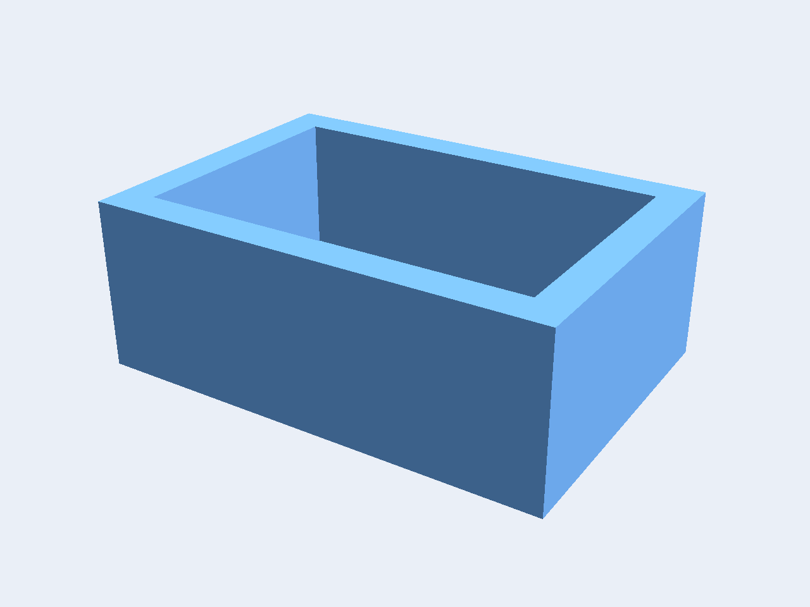<br>**Shell** hollows a solid into a wall of one thickness. |
| 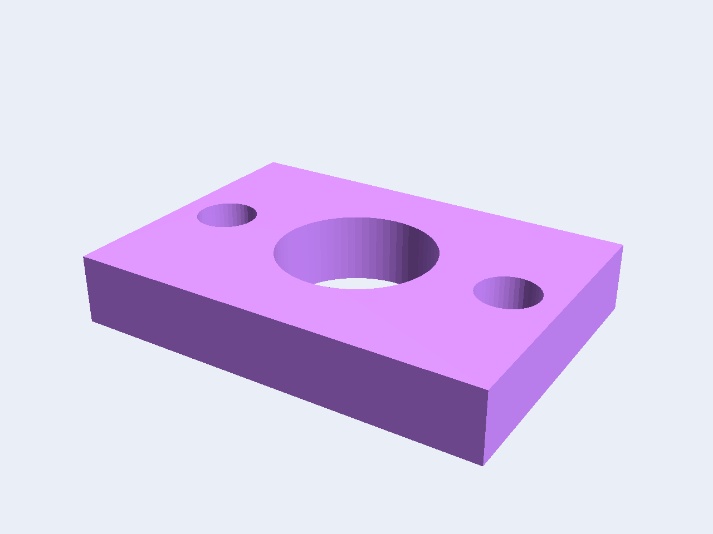<br>**Union, Cut and Intersect** combine two bodies explicitly, never folded into a feature. | 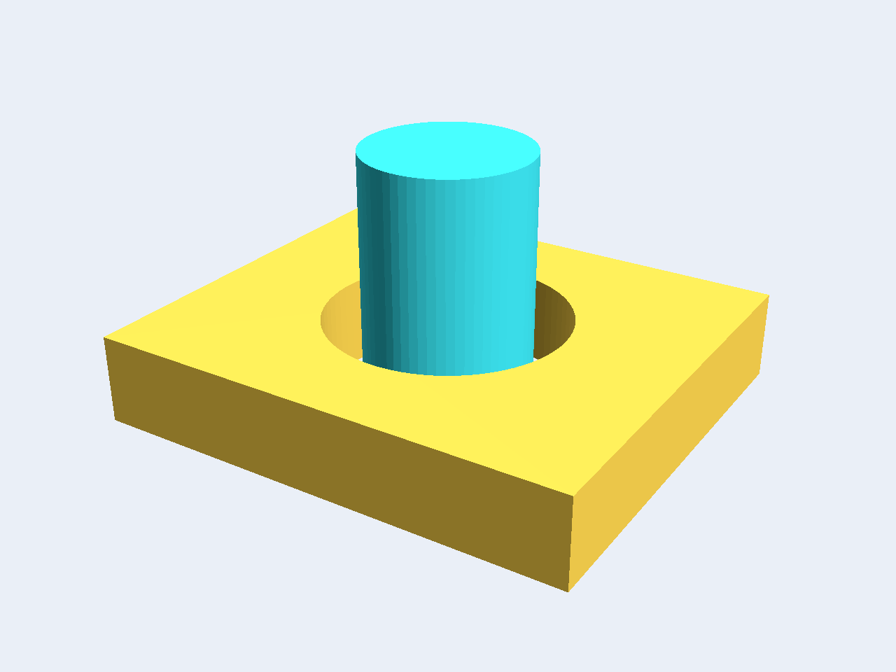<br>**Verify** proves the gap between two bodies, so a fit is checked before anything is cut. |

Regenerate every image on this page with `cd _gallery && go run .`.

## Layering

```
decad    3D bodies, features, verification   (this module)
  |
sketch   parametric 2D constraint solving    github.com/lestrrat-3d/sketch
  |
r3       vectors, frames, rigid transforms   github.com/lestrrat-3d/r3
  |
units    typed quantities (Value, Kind)      github.com/lestrrat-3d/units
```

The arrows point **down and never back up**. decad imports `sketch`, `r3` and
[`units`](https://github.com/lestrrat-3d/units); none of them knows decad
exists.

This is the layer both of them deliberately left room for. `r3` excludes shapes
by charter — *"if it lives in ℝ³ it belongs here; if it **is** a shape, it does
not"* — and `sketch` excludes anything that must be computed **from** a solid,
consuming 3D-derived geometry only as first-class reference geometry it is
*given*. decad is what sits on the other side of that seam.

A 2D question — does this profile close, is this sketch fully constrained — is
`sketch`'s to answer, and decad consumes the answer rather than re-deriving it.

## License

This project is **source-available**, and is licensed under the
[PolyForm Noncommercial License 1.0.0](LICENSE).

* **Noncommercial use is free.** Individuals, hobby and personal projects,
  research, education, nonprofits, and government may use, modify, and
  redistribute it at no cost, subject to the license terms.
* **Commercial / business use requires a separate license.** Any use by or for
  a business, or for commercial advantage, is not permitted under the
  noncommercial license. To obtain a commercial license, reach out on Bluesky
  at [@lestrrat.bsky.social](https://bsky.app/profile/lestrrat.bsky.social).

### Contributions

This repository does **not** accept external pull requests.
