# decad

<p align="center">
  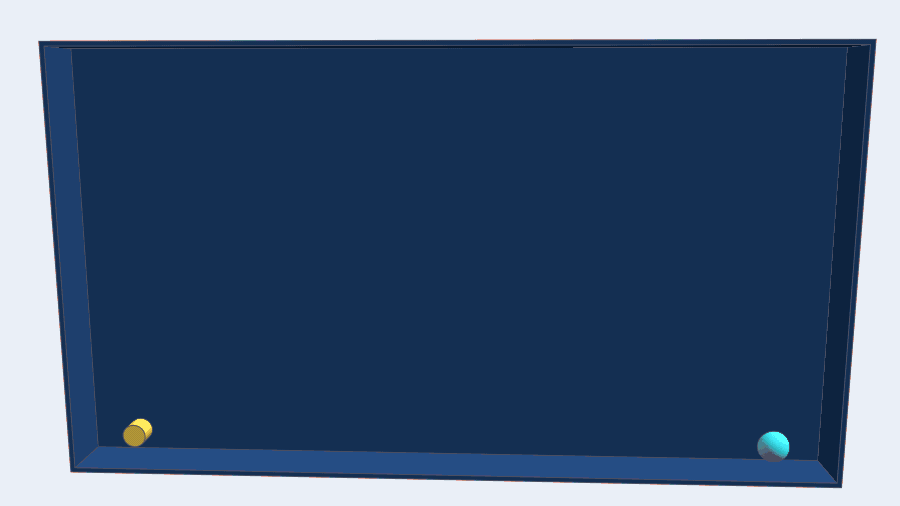
</p>

A **headless CAD system** for Go: the 3D modeling layer above the
[sketch](https://github.com/lestrrat-3d/sketch) 2D constraint engine and the
[r3](https://github.com/lestrrat-3d/r3) coordinate-math layer.

> **Work in progress.** The API and supported capabilities may change.

## Why this exists

When a designer wanted a parametric part, they worked in a CAD app. They drew
sketches, gave them dimensions, and added features such as extrusions and cuts.
If a dimension changed, the app rebuilt the part from those steps. The designer
could inspect the result and adjust the model in the same place. That workflow
still works.

Coding agents can now make convincing 3D shapes. Some are good enough for a
one-off render or print. But if you ask for a bevel gear built to given
dimensions, a shape that looks like a gear is only the start. Its teeth have
to mesh with its mate. A fresh request to the agent may also produce different
geometry. Variation may be fine for a one-off model; it makes a dimensioned
part hard to reproduce.

With [decad](https://github.com/lestrrat-3d/decad), a Go program builds and
checks a CAD model without a CAD app. It defines dimensioned sketches and
ordered modeling operations, then builds 3D bodies from them. decad can
tessellate those bodies for rendering. The program can measure volume and
centroid, check whether bodies interfere or have enough clearance, and ask
whether a wall is too thin for a cutting tool. An agent can change a dimension
or feature, run the program again, and inspect the new body and verification
report. With the program and inputs held fixed, **the same model can be rebuilt**
without a fresh request to the agent.

An agent can also use decad to verify a construction before writing an add-in
that builds it in Autodesk Fusion or another CAD app. That route may be more
practical when rebuilding the model in decad is too slow for the intended use.
decad's performance may improve, but matching those apps' speed is not its
primary goal. The agent checks the part in the app too, because it may
interpret the steps differently.

For certified shape and motion paths, decad can detect a collision and compute
the resulting rigid-body motion. The [current support guide](docs/collision-v1-support.md)
names those paths, and the [box collision example](examples/dynamics_box_collision_example_test.go)
runs an impact and reports the rebound.

## What it builds

Each animation shows intermediate decad bodies rendered from the triangle
meshes decad tessellates.

<table>
<tr>
<td>
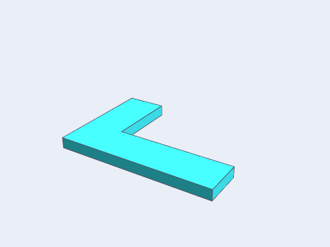<br>
<strong>Extrude</strong> sweeps a solved 2D profile straight into a solid.
</td>
<td>
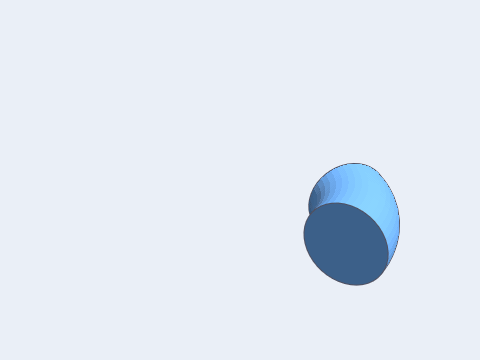<br>
<strong>Revolve</strong> spins a profile about an axis, so a curved generator gives a curved solid.
</td>
</tr>
<tr>
<td>
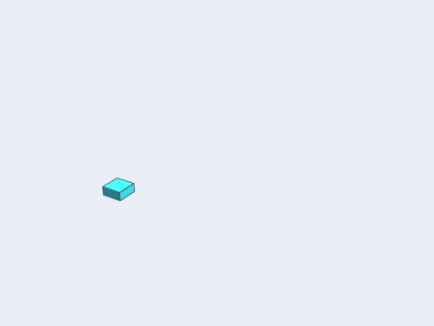<br>
<strong>Sweep</strong> moves one solved profile along a 3D path with two mitred bends.
</td>
<td>
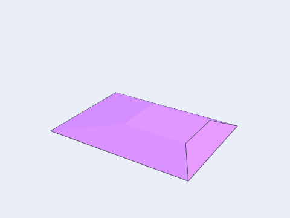<br>
<strong>Loft</strong> rules a wall between two profiles on different planes.
</td>
</tr>
<tr>
<td>
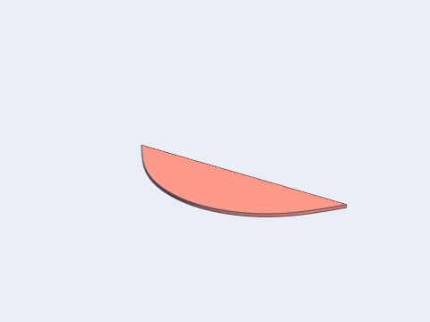<br>
<strong>Free-form profiles</strong> carry spline walls, measured exactly rather than approximated.
</td>
<td>
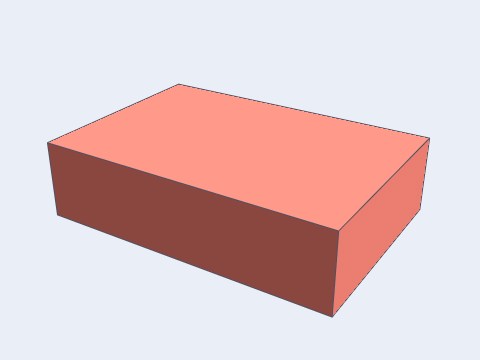<br>
<strong>Fillet</strong> rounds selected edges into tangent arcs.
</td>
</tr>
<tr>
<td>
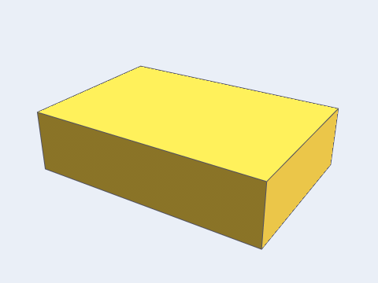<br>
<strong>Chamfer</strong> cuts selected edges back to a straight bevel.
</td>
<td>
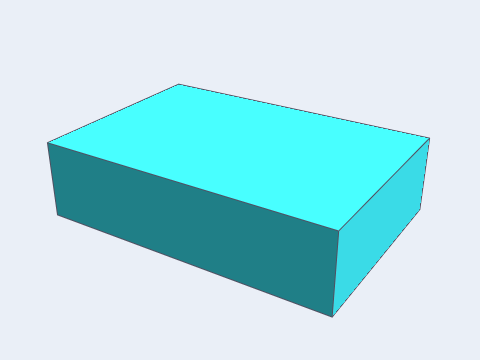<br>
<strong>Cap-loop chamfer</strong> bevels a whole rim, the lead-in a bore or a lid needs.
</td>
</tr>
<tr>
<td>
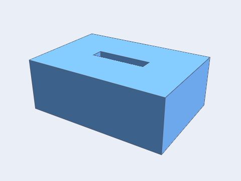<br>
<strong>Shell</strong> hollows a solid into a wall of one thickness.
</td>
<td>
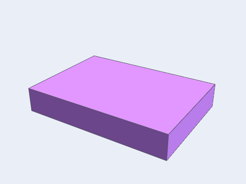<br>
<strong>Union, Cut and Intersect</strong> combine two bodies explicitly, never folded into a feature.
</td>
</tr>
<tr>
<td>
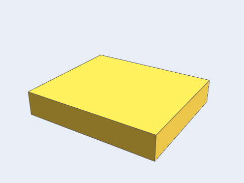<br>
<strong>Verify</strong> proves the gap between two bodies, so a fit is checked before anything is cut.
</td>
<td>
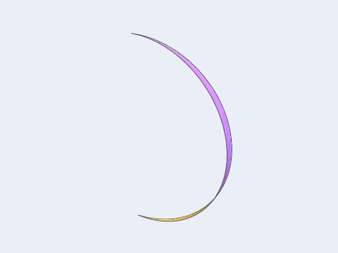<br>
<strong>Surface result</strong> keeps a feature's swept walls and omits the faces that exist only to close the solid,
leaving a sheet body.
</td>
</tr>
</table>

Regenerate the gallery GIFs with `cd _gallery && go run . features` (requires
`ffmpeg`). The still images can be regenerated with `go run .`. From `_gallery`,
regenerate the animated hero with `go run . hero > hero-assemble.sh && sh hero-assemble.sh`.
Its letters assemble, a light crosses them, the finished logo holds for ten
seconds, and the letters lift away before the loop repeats.

The landing-page clip animates several gallery parts, a curved duct, and the wordmark. Render it with
`cd _gallery && go run . clip > assemble.sh && sh assemble.sh`: the program
writes each shot's PNG frames under `_gallery/out/` and prints the two ffmpeg
commands, which the script runs to write `out/decad-landing.mp4` and
`out/decad-landing.gif`.

The `stack-and-drop` dynamics scene drops spheres and a cylinder beside a
resting box pyramid, every frame a certified pose of a `dynamics.Timeline`.
Render it with `cd _gallery && go run . dynamics -scene stack-and-drop`; the
frames go under `_gallery/out/`. The `tumble` scene drops spinning boxes, a
hexagonal prism, a wedge and a stitched tetrahedron into a tray, where each
lands on a corner and comes to rest face down; `-scene tumble` renders it.
The `parts-bin` scene drops a shelled cup, a chamfered block, a loft, a swept
hexagon and a revolved bottle into the same tray, where each comes to rest,
while a cylinder rolls across its floor; `-scene parts-bin` renders it.

The `linkage` scene films a mechanism that `VerifyLinkage` has checked. A
two-link arm folds into a wall, and the check finds the first collision at
s = 86/256, the first point of its 1/256 grid past the exact contact at
s = 1/3. The clip shows frame i at s = i/256 using the poses `Linkage.PoseAt`
returns, and the forearm turns coral from frame 86. Render it with
`cd _gallery && go run . linkage`; the frames go under `_gallery/out/`.

## Layering

```
decad    3D bodies, features, verification   (this module)
  |
sketch   parametric 2D constraint solving    github.com/lestrrat-3d/sketch
  |
r3       vectors, frames, rigid transforms   github.com/lestrrat-3d/r3
  |
units    typed quantities (Value, Kind)      github.com/lestrrat-3d/units
```

The arrows point **down and never back up**. decad imports `sketch`, `r3` and
[`units`](https://github.com/lestrrat-3d/units); none of them knows decad
exists.

This is the layer both of them deliberately left room for. `r3` excludes shapes
by charter — *"if it lives in ℝ³ it belongs here; if it **is** a shape, it does
not"* — and `sketch` excludes anything that must be computed **from** a solid,
consuming 3D-derived geometry only as first-class reference geometry it is
*given*. decad is what sits on the other side of that seam.

A 2D question — does this profile close, is this sketch fully constrained — is
`sketch`'s to answer, and decad consumes the answer rather than re-deriving it.

## License

This project is **source-available**, and is licensed under the
[PolyForm Noncommercial License 1.0.0](LICENSE).

* **Noncommercial use is free.** Individuals, hobby and personal projects,
  research, education, nonprofits, and government may use, modify, and
  redistribute it at no cost, subject to the license terms.
* **Commercial / business use requires a separate license.** Any use by or for
  a business, or for commercial advantage, is not permitted under the
  noncommercial license. To obtain a commercial license, reach out on Bluesky
  at [@lestrrat.bsky.social](https://bsky.app/profile/lestrrat.bsky.social).

### Contributions

This repository does **not** accept external pull requests.
